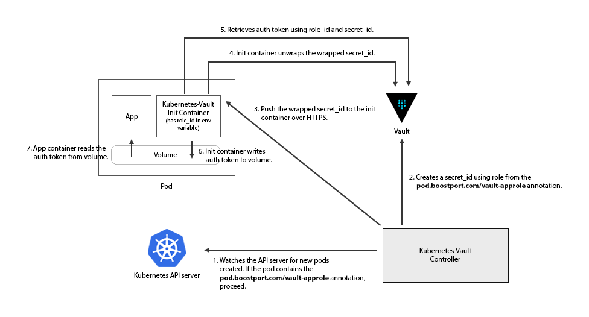

# CI Sample Application

Scenario 2: Applications run on Kubernetes



### Configure Vault policies
Follow these steps to configure Vault in order to run the application

- Login to vault with a user has proper permissions.   
  ```bash
  $ vault login -method=userpass username=nthienan
  Password (will be hidden): <enter password here>
  Key                    Value
  ---                    -----
  token                  s.TiaDOUCNHQlfmf97fzx5t0tR
  token_accessor         6gbw8tq7xPDF509AWLn9tNzk
  token_duration         768h
  token_renewable        true
  token_policies         ["admin" "default"]
  identity_policies      []
  policies               ["admin" "default"]
  token_meta_username    nthienan
  ``` 
- Create an app role for the application that generates a periodic 6 hour token:
  ```bash
  $ vault write auth/approle/role/k8s-vault-app \
      secret_id_ttl=90s \
      secret_id_num_uses=1 \
      period=15m \
      policies="read-mongo-credential"
  Success! Data written to: auth/approle/role/k8s-vault-app
  ```
- Modify `kubernetes-vault` policy for adding new rule in order to read secret id of `k8s-vault-app` role
  * Read existing rules from the policy:
    ```bash
    $ vault policy read kubernetes-vault
    path "intermediate-ca/issue/kubernetes-vault" {
      capabilities = ["update"]
    }
    path "auth/token/roles/kubernetes-vault" {
      capabilities = ["read"]
    }
    ```
  * Append a new rule to `kubernets-vault` policy:
    ```bash
    $ echo '
    path "intermediate-ca/issue/kubernetes-vault" {
      capabilities = ["update"]
    }
    path "auth/token/roles/kubernetes-vault" {
      capabilities = ["read"]
    }
    path "auth/approle/role/k8s-vault-app/secret-id" {
      capabilities = ["update"]
    }' | vault policy write kubernetes-vault -
    Success! Uploaded policy: kubernetes-vault
    ```
- Get the app's role id:
  ```bash
  $ vault read auth/approle/role/k8s-vault-app/role-id
  Key        Value
  ---        -----
  role_id    bcdb5a5a-bae6-fbdd-6d07-1d5d475fe148
  ```

### Appendix

#### Generating Kubernetes credentials
     
The following example describes how you could use the token of a ServiceAccount to access the Kubernetes cluster from Jenkins
```bash
# Create a ServiceAccount named `jenkins-bot` in a given namespace.
$ kubectl -n <namespace> create serviceaccount jenkins-bot
serviceaccount/jenkins-bot created

# The next line gives `jenkins-bot` administator permissions for this namespace.
# * You can make it an admin over all namespaces by creating a `ClusterRoleBinding` instead of a `RoleBinding`.
# * You can also give it different permissions by binding it to a different `(Cluster)Role`.
$ kubectl -n <namespace> create rolebinding jenkins-bot-binding --clusterrole=cluster-admin --serviceaccount=<namespace>:jenkins-bot
rolebinding.rbac.authorization.k8s.io/jenkins-bot-binding created

# Get the name of the token that was automatically generated for the ServiceAccount `jenkins-bot`.
$ kubectl -n <namespace> get serviceaccount jenkins-bot -o go-template --template='{{range .secrets}}{{.name}}{{"\n"}}{{end}}'
jenkins-bot-token-68x9t

# Retrieve the token and decode it using base64.
$ kubectl -n <namespace> get secrets jenkins-bot-token-68x9t -o go-template --template '{{index .data "token"}}' | base64 -d
eyJhbGciOiJSUzI1NiIsImtpZCI6IiJ9[...]
```
On Jenkins, navigate in the folder you want to add the token in, or go on the main page. Then click on the `Credentials` item in the left menu and find or create the `Domain` you want. Finally, paste your token into a Secret text credential. The ID is the credentialsId you need to use in Jenkinsfile.
