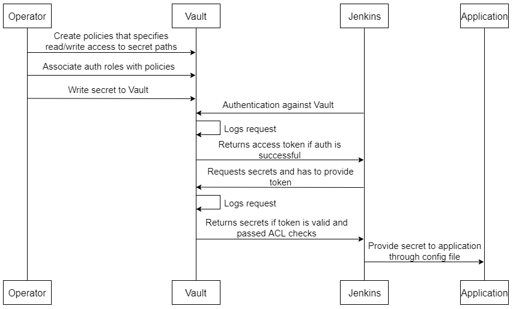

# CI Sample Application
Scenario 1: Legacy applications that don’t run on Kubernetes


### Configure Vault policies

This guide will walk you through configure Vault policies in order to run this application.

Login as a user who has proper permissions:
```bash
$ vault login -method=userpass username=nthienan
Password (will be hidden): <type nthienan's password>
```
AppRole is a secure introduction method to establish machine identity. In AppRole, in order for the application to get a token, it would need to login using a Role ID (which is static, and associated with a policy), and a Secret ID (which is dynamic, one time use, and can only be requested by a previously authenticated user/system.
Let's creat necessary policies for team-a:
```bash
$ echo 'path "kv/data/team-a/*" {
  capabilities = ["read", "list"]
}
path "secret/data/team-a/*" {
  capabilities = ["read", "list"]
}' | vault policy write team-a-readonly -
```
In this case, tokens assigned to the `team-a-readonly` policy would have permission to read a secret on the `secret/team-a/*` path.

Now we have to create a role that will generate tokens associated with policy `team-a-readonly`
```bash
$ vault write auth/approle/role/team-a \
	secret_id_ttl=60m \
	token_ttl=15m \
	token_max_ttl=120m \
	policies="team-a-readonly"
```
Read role id and take it down for later steps
```bash
$ vault read auth/approle/role/team-a/role-id
Key        Value
---        -----
role_id    84092a58-fcfb-ea53-a13e-628bd43bc966
```
Note that in this case, the tokens generated through this role have a time-to-live of 15 minutes. That means that after 15 minutes, that token is expired and can’t be used anymore. If your Jenkins jobs are shorted, you can adjust that time to live to increase security.

Let’s write secrets that our Jenkins job will consume:
```bash
$ vault secrets enable -version=2 kv
Success! Enabled the kv secrets engine at: kv/
$ vault kv put kv/team-a/mongodb username=mongo_root password=123456
```
Now Jenkins will need permissions to retrieve role's secret-id for our newly created role. Jenkins shouldn’t be able to access the secret itself, list other Secret IDs, or even the Role ID.
```bash
$ echo 'path "auth/approle/role/team-a/secret-id" {
  capabilities = ["read","create","update"]
}' | vault policy write jenkins -
```
And generate a token for Jenkins to login into Vault. This token should have a relatively large TTL, but will have to be rotated
```bash
$ vault token create -policy=jenkins -ttl=8760h
WARNING! The following warnings were returned from Vault:

  * TTL of "8760h0m0s" exceeded the effective max_ttl of "768h0m0s"; TTL value
  is capped accordingly

  * Policy "jenkins" does not exist

Key                  Value
---                  -----
token                s.mC73IMlyVYj79z7XhhRk5zh6
token_accessor       s4bpAFaEDIOpiwS7JKwS9WJQ
token_duration       768h
token_renewable      true
token_policies       ["default" "jenkins"]
identity_policies    []
policies             ["default" "jenkins"]
```
In this way we’re minimizing attack vectors:
* Jenkins only knows it’s Vault Token (and potentially the role-id) but doesn’t know the secret-id, which is generated at pipeline runtime and it’s for one time use only.
* The role-id can be stored in the Jenkinsfile. Without a token and a secret-id has no use.
* The secret-id is dynamic and one time use only, and only lives for a short period of time while it’s requested and a login process is carried out to obtain a token for the role.
* The role token is short lived, and it will be useless once the pipeline finishes. It can even be revoked once you’re finished with your pipeline.

To better illustrate please refer picture below


